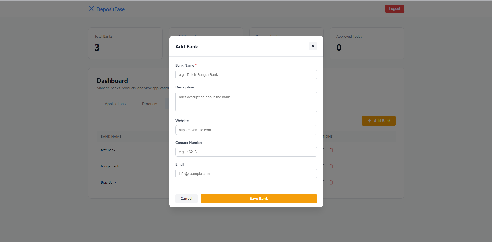
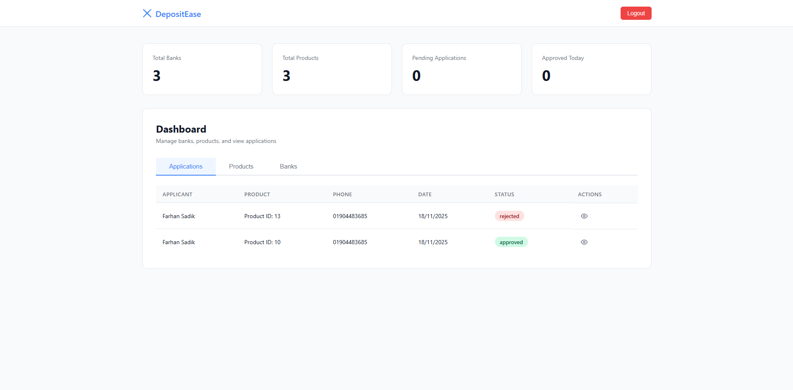
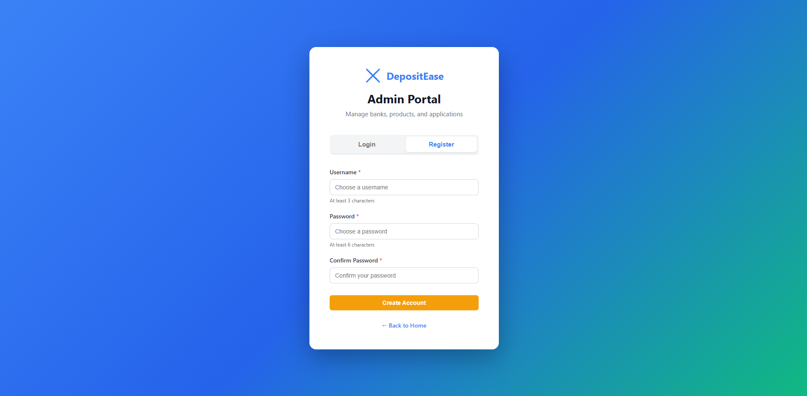
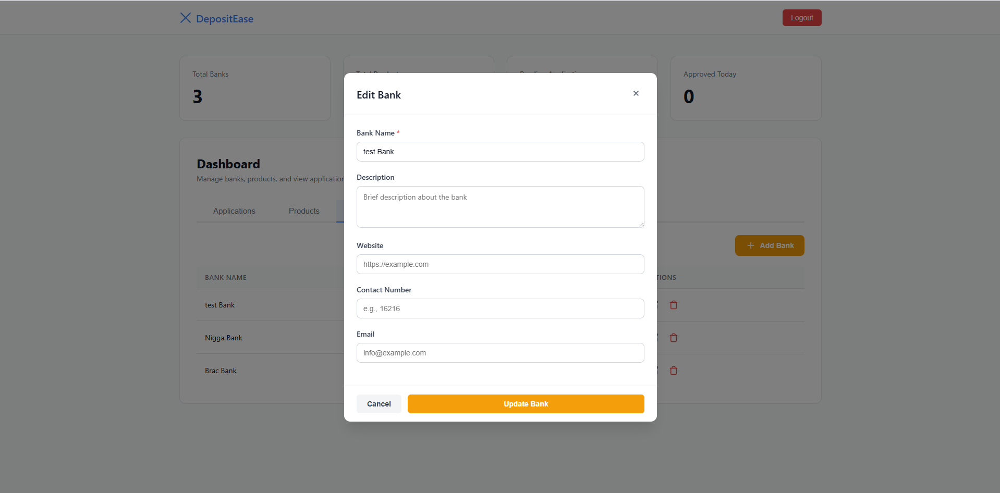
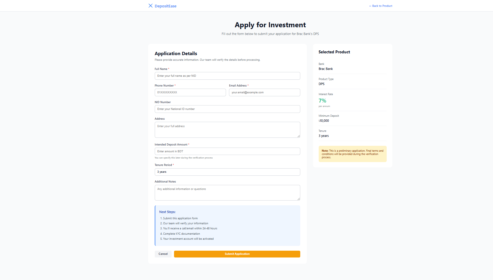
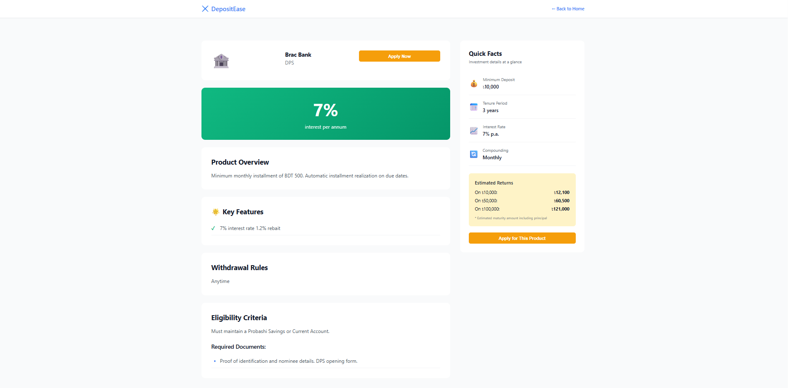

# DepositEase

DepositEase is a deposit management platform designed for banks and financial institutions. It enables users to explore deposit products, apply for accounts, and manage applications efficiently.

## Technologies Used
- **Backend:** FastAPI (Python), SQLAlchemy ORM
- **Database:** PostgreSQL
- **Frontend:** HTML, CSS, JavaScript
- **Authentication:** Secure password hashing and admin management
- **Environment Management:** dotenv for configuration

## Features
- Bank and product management
- Application workflow for deposit products
- Admin dashboard for approvals and reviews
- Sample data initialization for quick testing
- Modular architecture for scalability

## Getting Started
1. Clone the repository:
   ```sh
   git clone https://github.com/frhnsdk/depositease.git
   ```
2. Set up the backend:
   - Install dependencies:
     ```sh
     pip install -r Backend/requirements.txt
     ```
   - Configure your `.env` file in `Backend/` with your PostgreSQL credentials.
   - Run the database setup:
     ```sh
     python Backend/create_database.py
     ```
   - Start the FastAPI server:
     ```sh
     uvicorn Backend/main:app --reload
     ```
3. Open the frontend HTML files in your browser from the `Frontend/` directory.

## Folder Structure
- `Backend/` - Python backend (API, models, database scripts)
- `Frontend/` - Static frontend files (HTML, CSS, JS)

## License

## License
This project is proprietary. All rights reserved by the author. Unauthorized use, copying, or distribution is prohibited.


## Screenshots

Below are some screenshots of DepositEase:

<div align="center">
  
  <br>
  
  <br>
  
  <br>
  
  <br>
  
  <br>
  
  <br>

  
  <br>
  
</div>

## Author
[frhnsdk](https://github.com/frhnsdk) & SF Zakaria
